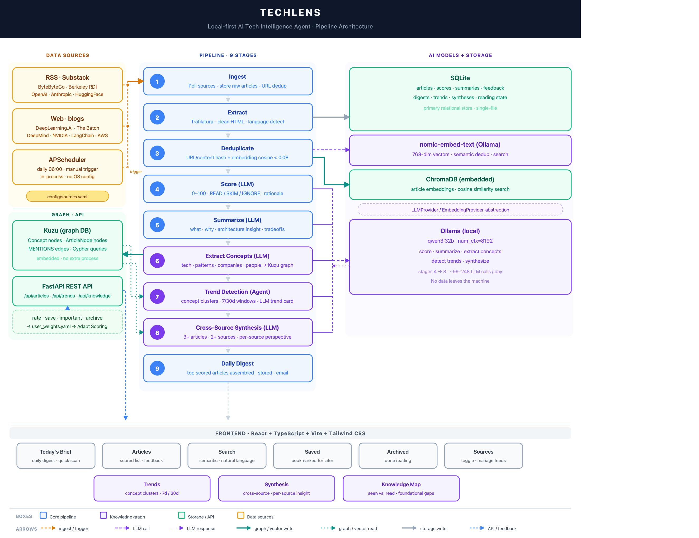

# TechLens

**Local-first AI Tech Intelligence Agent** — from information overload to a focused 5–10 min/day briefing.

TechLens continuously ingests tech and AI content from RSS feeds and newsletters, filters ruthlessly using a local LLM, and produces a personalized daily briefing. Everything runs on your laptop — no API keys, no per-token costs, no data leaving your machine.

---

## The Problem

Reading tech content at a Principal/Staff Engineer level means:
- Too many sources, too much duplication
- Generic summaries that don't explain *why* something matters architecturally
- No way to connect individual articles into larger trends
- Information consumed but not retained

TechLens solves this with a pipeline that scores, deduplicates, summarizes, and now tracks knowledge across articles — through the lens of a Principal AI Architect career profile.

---

## What's Built

### Phase 1 — Core Pipeline (complete)

| Stage | What it does |
|---|---|
| **Ingest** | Polls RSS feeds and web sources on a schedule |
| **Extract** | Cleans HTML, pulls readable content via Trafilatura |
| **Deduplicate** | Hash-based + semantic (embedding cosine similarity < 0.08) |
| **Score** | LLM rates each article 0–100 with READ / SKIM / IGNORE + rationale |
| **Summarize** | Structured summary: what happened, why it matters, architecture insight, tradeoffs, reading time |
| **Digest** | Assembles daily briefing from top-scored articles |

### Phase 2 — Semantic Search + User Feedback (complete)

- **Embeddings** — every article embedded with `nomic-embed-text` into ChromaDB for semantic dedup and search
- **Semantic search** — find articles by topic using natural language (e.g. "agent memory patterns")
- **User feedback** — save, mark important, rate up/down, open tracking
- **Adaptive scoring** — feedback signals aggregated per topic; applied as personalization hints on future pipeline runs

### Phase 3 — Knowledge Graph + Intelligence (complete)

- **Concept extraction** — LLM extracts named concepts from each article summary and writes them into a Kuzu embedded graph DB
- **Trend detection** — agent queries the concept graph for clusters that appear across 2+ sources or 3+ articles in 7/30-day windows; LLM synthesizes a trend card (name, summary, confidence, evidence articles)
- **Cross-source synthesis** — when 3+ articles from 2+ sources cover the same concept, LLM generates a synthesis card: unified summary, what each source uniquely adds, and a one-sentence architecture takeaway
- **Knowledge map** — shows every concept you've encountered (Seen) vs. read (opened an article about it), plus a gap list of foundational AI/architecture concepts you haven't covered yet

---

## Quick Start

### Prerequisites

- [Ollama](https://ollama.com) installed and running
- Models pulled:
  ```bash
  ollama pull qwen3:32b
  ollama pull nomic-embed-text
  ```
- [uv](https://docs.astral.sh/uv/) (Python package manager)
- Node.js 18+

### Install

```bash
cd techlens

# Install Python dependencies
uv sync

# Install frontend dependencies
cd frontend && npm install && cd ..

# Copy and edit config
cp .env.example .env
```

### Run

Open two terminals:

```bash
# Terminal 1 — backend
make backend
# or: PYTHONPATH=src uv run uvicorn techlens.api.main:app --reload --port 8005

# Terminal 2 — frontend dev server
make frontend
# or: cd frontend && npm run dev
```

Open `http://localhost:5173`.

### Run the pipeline manually

```bash
make pipeline
# or: PYTHONPATH=src uv run python -c "from techlens.scheduling.scheduler import run_pipeline; run_pipeline()"
```

The pipeline also runs automatically every day at 06:00 (configurable in `.env`).

---

## UI Guide

| Tab | What it's for |
|---|---|
| **Today's Brief** | Concise daily summary — headline, why it matters, architecture insight per article. Quick scan only. |
| **Articles** | Full scored list with detailed summaries, insights, tradeoffs, and feedback actions. |
| **Search** | Semantic search — find articles on a topic using natural language. |
| **Saved** | Articles bookmarked for future reference. |
| **Archived** | Articles you're done with — archived to keep your main feed clean. |
| **Trends** | Detected trend cards — concepts appearing across multiple sources in 7/30-day windows. |
| **Synthesis** | Cross-source synthesis cards — what multiple sources are saying about the same topic and what each uniquely adds. |
| **Knowledge** | Your personal knowledge map — concepts seen vs. read, and foundational gaps to fill. |
| **Sources** | View and toggle configured RSS/web sources. |

### Article Card Actions

| Action | Meaning |
|---|---|
| 👍 / 👎 | Rate the recommendation quality — feeds adaptive scoring |
| 🔖 Save | Bookmark for future reference |
| ⭐ Important | Flag as high-value — weighted 3× in engagement scoring |
| Archive | Mark as done reading — removes from main feed |
| Read original → | Opens the full article at its source |

### Sidebar Controls

- **Run Pipeline** — manually trigger the full pipeline (collect → extract → score → summarize → concepts → trends → synthesis → digest)
- **Adapt Scoring** — aggregate your feedback and apply topic weights to the next scoring run
- **Pipeline status** — live counts for each pipeline stage (pending, extracted, scored, summarized, ignored, failed)
- **How it works** (▸) — collapsible legend explaining what each UI action means

---

## Pipeline Stages

```
RSS / Web Sources
      ↓
  Ingest & Store           — polls sources, stores raw articles
      ↓
  Content Extraction       — strips HTML, normalises text (Trafilatura)
      ↓
  Deduplication            — hash match + embedding cosine similarity
      ↓
  Relevance Scoring        — LLM scores 0–100 + READ/SKIM/IGNORE
      ↓
  Summarization            — structured summary (IGNORE articles skipped)
      ↓
  Concept Extraction       — LLM extracts named concepts → Kuzu graph DB
      ↓
  Trend Detection          — agent queries concept graph, detects clusters
      ↓
  Cross-Source Synthesis   — LLM synthesizes multi-source coverage
      ↓
  Daily Digest             — top articles assembled + stored
```

Article statuses: `pending → extracted → scored → [summarized | ignored | failed]`

The sidebar shows live cumulative counts for each stage.

---

## Adaptive Scoring

After using TechLens for a few days and giving feedback, you can teach the scorer your preferences:

1. Click **"Adapt Scoring"** in the sidebar.
2. TechLens aggregates your engagement signals per topic category.
3. Topics you consistently engage with get a scoring boost (+up to 10 points) on the next run.
4. Topics you rarely open or down-rate get a penalty.

Weights are saved to `config/user_weights.yaml` and loaded automatically on each pipeline run.

**Engagement formula per topic:**

```
score = (opens×1 + saves×2 + important×3 + rated_up×2 - rated_down×2) / total_articles
```

Topics need at least 2 articles before a signal is trusted. Raw stats are available at `GET /api/feedback/insights`.

---

## Knowledge Graph (Phase 3)

Phase 3 introduces a concept graph stored in [Kuzu](https://kuzudb.com) — an embedded graph database (no extra process, no Docker required for the main app).

### How it works

```
Article summary
      ↓
  Concept Extractor (LLM)  — extracts: technology, framework, pattern, company, person, event
      ↓
  Kuzu graph DB            — Concept nodes + ArticleNode nodes + MENTIONS edges
      ↓
  Trend Detector (agent)   — queries concept co-occurrence across time windows
  Synthesizer              — groups articles by concept, calls LLM for synthesis card
  Knowledge Map API        — joins Kuzu concept data + SQLite opened_at for read state
```

### Trend Detection

The trend detector runs as a true agent (autonomous multi-step reasoning):
1. Queries Kuzu for concepts appearing in articles from the past 7 and 30 days
2. Qualifies a trend when: 3+ articles from 2+ sources, or 5+ articles from a single source
3. Deduplicates against recently active trends
4. Calls LLM to generate: trend name, 2-3 sentence summary, confidence (high/medium/low)
5. Saves trend card to SQLite with evidence article links; deactivates trends older than 35 days

### Cross-Source Synthesis

Synthesis runs after trend detection in the same pipeline pass:
1. Groups articles by concept cluster (articles sharing a primary concept in Kuzu)
2. Qualifies when: 3+ articles from 2+ unique sources
3. Calls LLM to generate: topic label, unified summary, per-source unique perspective, key architecture insight
4. Deactivates synthesis cards older than 60 days

### Knowledge Map

No new storage technology. Computed on-the-fly by joining:
- **Kuzu** — concept names, article counts, source counts (updated after each extraction run)
- **SQLite** — `articles.opened_at` to determine which articles you've read

A concept is **Seen** if it appears in the graph with article_count > 0. It's **Read** if at least one linked article has `opened_at IS NOT NULL`. The gap list cross-references foundational AI/architecture concepts against what you've seen.

### Visualising the Graph (Kuzu Explorer)

Stop the TechLens backend first (Kuzu allows only one writer at a time), then:

```bash
docker run -p 55000:8000 \
  -v /path/to/techlens/data.nosync:/database \
  -e KUZU_FILE=kuzu_graph \
  --rm kuzudb/explorer:latest
```

Open `http://localhost:55000` and type Cypher queries directly in the query box.

Useful queries:
```cypher
-- Top concepts by mention count
MATCH (c:Concept) RETURN c ORDER BY c.article_count DESC LIMIT 20;

-- Articles that mention a specific concept
MATCH (a:ArticleNode)-[:MENTIONS]->(c:Concept {name: "Retrieval Augmented Generation"})
RETURN a.article_id, c.name;

-- Concept co-occurrence (proto-trend signal)
MATCH (a:ArticleNode)-[:MENTIONS]->(c1:Concept),
      (a)-[:MENTIONS]->(c2:Concept)
WHERE c1.name < c2.name
RETURN c1.name, c2.name, count(a) AS co_occurrences
ORDER BY co_occurrences DESC LIMIT 10;
```

---

## Configuration

### Relevance Profile — `config/profile.yaml`

Controls which topics score highest and the digest size.

```yaml
relevance_tiers:
  tier1:                     # highest priority — score boost
    topics: [agentic_ai, multi_agent_architecture, enterprise_ai, rag, ...]
  tier2:
    topics: [generative_ai, vector_databases, model_serving, ...]

digest:
  max_daily_items: 50
  min_score_for_digest: 60
```

### Sources — `config/sources.yaml`

Add, remove, or disable sources without touching code. Toggle sources on/off from the **Sources** tab in the UI.

### Environment — `.env`

```bash
OLLAMA_BASE_URL=http://localhost:11434
OLLAMA_MODEL=qwen3:32b
OLLAMA_EMBED_MODEL=nomic-embed-text
OLLAMA_NUM_CTX=8192           # never lower this — 4096 silently truncates long posts

DATABASE_URL=sqlite:///./techlens.db
CHROMA_PATH=./data.nosync/chroma
KUZU_PATH=./data.nosync/kuzu_graph   # graph DB directory (created on first run)

LLM_THROTTLE_SECONDS=1.0      # sleep between LLM calls — reduces fan noise
LLM_BATCH_SIZE=0              # 0 = no limit; set to e.g. 15 for smaller bursts

PIPELINE_SCHEDULE_HOUR=6
PIPELINE_SCHEDULE_MINUTE=0
```

---

## Tech Stack

| Layer | Choice | Why |
|---|---|---|
| LLM | Ollama — `qwen3:32b` | Local, free, no data leaves machine |
| Embeddings | Ollama — `nomic-embed-text` | Local 768-dim embeddings for dedup + search |
| Backend | Python 3.11, FastAPI, APScheduler | Type-safe, async, in-process scheduler |
| Relational DB | SQLite | Single-user, single-process — right tool for the scale |
| Vector DB | ChromaDB (embedded) | Local vector search, semantic dedup |
| Graph DB | Kuzu (embedded) | Cypher queries, no extra process, Neo4j-compatible syntax |
| Frontend | React + TypeScript + Vite + Tailwind | Type-safe API boundary, fast HMR |
| Package manager | `uv` | Fast, lockfile-based Python dependency management |
| Config | Pydantic Settings | Env vars + `.env`, validated at startup |

The LLM and embedding providers are abstracted behind `LLMProvider` / `EmbeddingProvider` interfaces. Swap to a cloud provider (Groq, OpenAI) by changing config, not code.

---

## Roadmap

| Phase | Status | Description |
|---|---|---|
| **Phase 1** | ✅ Complete | RSS ingestion, scoring, summarization, daily digest, local UI |
| **Phase 2** | ✅ Complete | Embeddings, semantic dedup, semantic search, user feedback, adaptive scoring |
| **Phase 3** | ✅ Complete | Kuzu knowledge graph, concept extraction, trend detection, cross-source synthesis, knowledge map |
| **Phase 4** | Planned | Interview coach, knowledge-gap detection, adaptive learning loop, weekly briefing |

### Phase 4 — Interview Coach + Learning Loop
Generate Principal Architect interview questions grounded in what you've been reading. Track knowledge states (Seen → Read → Understood → Mastered). Surface gaps: "You've read 8 articles on agent evaluation but never demonstrated understanding."

---

## Architecture Diagram



Editable source: [`docs/architecture.svg`](docs/architecture.svg)

---

## Further Reading

| Document | What it covers |
|---|---|
| [`docs/PROJECT.md`](docs/PROJECT.md) | Full product vision, success criteria, UX spec, phased roadmap |
| [`docs/TECH.md`](docs/TECH.md) | Tech stack decisions, storage strategy, repo layout |
| [`docs/AGENTS.md`](docs/AGENTS.md) | Pipeline stage specs, agent designs for Phase 3/4 |
| [`docs/architecture.svg`](docs/architecture.svg) | Full pipeline architecture diagram — 9 stages, storage, AI, frontend |
| [`docs/inference-calls.md`](docs/inference-calls.md) | Every LLM call in the pipeline: which model, which stage, how many per day, throttling controls, and cost at scale |
| [`docs/architecture-tradeoffs.md`](docs/architecture-tradeoffs.md) | Every non-obvious tech decision with alternatives considered — Ollama vs cloud, Kuzu vs Neo4j, SQLite vs Postgres, deterministic pipeline vs agents, and more |
| [`docs/hosting-options.md`](docs/hosting-options.md) | How to move off your laptop (Oracle Cloud, Groq, Vercel, Tailscale) |
| [`docs/lessons-learned.md`](docs/lessons-learned.md) | 10 lessons from building this as a side project |

---

*Stack: Python 3.11 · FastAPI · React + TypeScript · SQLite · ChromaDB · Kuzu · Ollama · APScheduler · Tailwind CSS*
